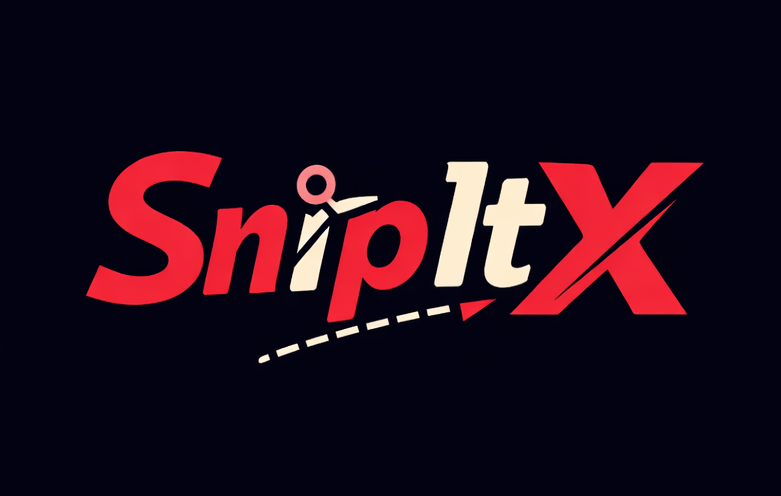

# SnipItX Links 🚀

> A fast and simple URL shortening web app built with **React**, designed for quick link sharing.

---

## 🖼️ Logo




---

## ✨ Description

**SnipItX Links** is a clean, dark-themed URL shortener web app that allows users to quickly convert long links into short, shareable URLs.  
It is built using **React**, with a minimal and user-friendly interface.

---

## 🚀 Features

- 🔗 Fast URL shortening  
- ✂️ Copy-to-clipboard feature  
- 🌙 Dark theme  
- ⚡ Smooth animations & interactive UI  
- 📱 Responsive design (mobile & desktop)  
- 📧 Contact page with a contact form  
- 💡 Clean and modern layout

---

## 🧰 Installation

1. Clone the repository:

```bash
git clone https://github.com/hiranya52/SnipItX-Links.git
cd snipitx-links

